# RAG Architecture and Guardrails

This document describes the local Retrieval-Augmented Generation (RAG) pipeline and safety controls.

## System Layers

1. Ingestion and normalization (`ingest.py`)
2. Embedding and vector storage (`embeddings.py` + ChromaDB)
3. Retrieval and generation (`chat.py`, artifact generation)
4. Guardrails and policy checks (`guardrails.py`)

## High-Level Flow

```mermaid
graph TD;
    A[Source Files / URLs / Images] --> B[Ingestion and Chunking];
    B --> C[nomic-embed-text Embeddings];
    C --> D[(ChromaDB per notebook)];

    E[User Query] --> F[Input Guardrails];
    F --> G[Vector Retrieval Top-K];
    G --> H[Prompt Assembly with Retrieved Context];
    H --> I[llama3.2 Generation];
    I --> J[Output Guardrails];
    J --> K[Streaming Response to UI];
```

## Ingestion Details

- Supported source types:
  - PDF
  - DOCX
  - TXT/MD
  - URL
  - Images (described with `llava:latest` before indexing)
- Chunking uses overlap to preserve context continuity across chunk boundaries.
- Each chunk keeps source metadata used for references and UI traceability.

## Retrieval

- Retrieval is notebook-isolated (separate vector collection per notebook).
- Query embedding uses `nomic-embed-text`.
- Top-K chunks are selected for grounding generation and artifact creation.

## Generation

- Main generation model: `llama3.2:latest`.
- Chat is streamed to UI.
- Artifact generation (summary, study guide, mind map, etc.) uses broad retrieval context.

## Guardrails (Quadrils / Guardrails)

Guardrails are enforced in two stages.

### Input Guardrails

- Off-topic detection
- Prompt injection / role hijack patterns
- Harmful intent filters

If blocked, request is rejected before LLM generation.

### Output Guardrails

- Harmful content checks
- Unsafe instruction checks
- Optional redaction or refusal

If output violates policy, response is blocked or replaced by safe fallback text.

## Lucidity-Specific Data Path

- Lucidity can bootstrap directly from notebook sources via `POST /api/from-notebook/{notebook_id}`.
- Source images are transformed into textual descriptions using `llava:latest` and merged with text sources.
- Graph generation runs asynchronously; frontend polls status and opens graph when ready.

## Operational Notes

- Fully local runtime, no cloud dependency required.
- Ensure Ollama is running with all required models pulled.
- ChromaDB persistence path is local under `data/chroma`.
