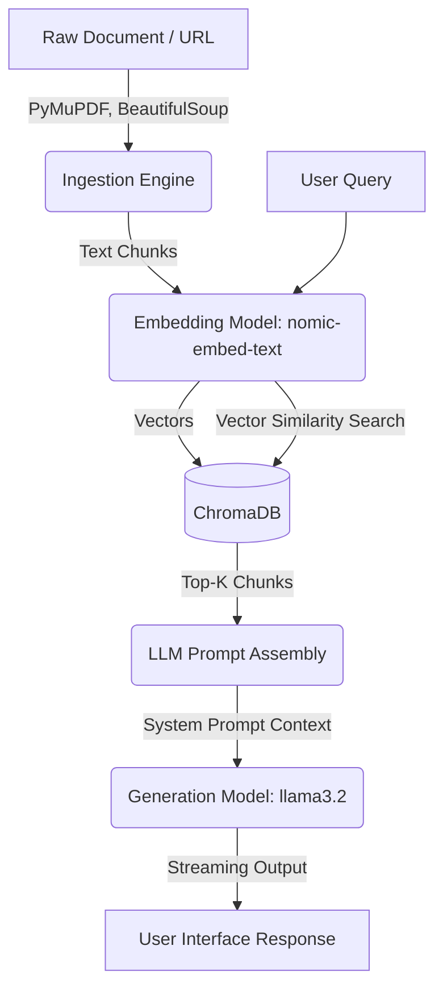

# RAG Architecture & Data Flow

This document details the Retrieval-Augmented Generation (RAG) pipeline implemented in the backend of this project (NotebookLM Clone / MAÏEUTICA). The pipeline is fully local and privacy-first, leveraging Ollama and ChromaDB.

---

## 🏗️ High-Level Architecture

The RAG pipeline is divided into three distinct layers:
1. **Ingestion & Chunking** (`ingest.py`)
2. **Embedding & Storage** (`embeddings.py`)
3. **Retrieval & Generation** (`chat.py` / `socratic_engine.py`)

---

## 1. Ingestion & Chunking (`ingest.py`)

The ingestion layer handles parsing knowledge from various formats and splitting it into digestible pieces.

- **Supported Formats**: 
  - PDFs (via `PyMuPDF` / `fitz`) - Extracts text while preserving page numbers.
  - Microsoft Word `.docx` (via `python-docx`).
  - Plain Text (`.txt`, `.md`).
  - Web URLs (via `httpx` and `BeautifulSoup` to strip boilerplate HTML like nav/footers).
- **Chunking Strategy**: 
  - **Chunk Size**: 400 characters (roughly 120-150 tokens).
  - **Overlap**: 60 characters. Overlaps are critical to prevent thought patterns or sentences from being improperly truncated across chunks, preserving contextual continuity for the LLM.
- **Metadata**: Every chunk maintains its source name and, if applicable (like PDFs), its source page number.

---

## 2. Embedding & Vector Storage (`embeddings.py`)

To enable semantic search, chunks are converted into mathematical vectors and stored in a vector database.

- **Embedding Model**: `nomic-embed-text` (running locally via Ollama). This model is highly efficient for generating semantic representations of text chunks.
- **Vector Database**: **ChromaDB** running in persistent, local mode (`data/chroma`). No cloud vector database is required.
- **Collection Strategy**: A separate ChromaDB collection is created per notebook (e.g., `nb_{notebook_id}`). This logically isolates contexts preventing cross-contamination between different notebooks.
- **Distance Metric**: `Cosine Similarity` (`hnsw:space: cosine`). This is standard for measuring the semantic angle between text vectors.

---

## 3. Retrieval & Generation 

Once user queries arrive, the system retrieves relevant chunks to ground the LLM's response.

### 3a. Standard RAG Chat (`chat.py`)
- **Retrieval**: Converts the user's question into an embedding via `nomic-embed-text` and retrieves the **top-5** (`k=5`) most semantically similar chunks from the notebook's Chroma collection.
- **Prompt Engineering**: 
  - A strict system prompt is used: *"You answer questions ONLY using the provided source excerpts below. Every claim you make must be backed by one of the sources."*
  - **Citations**: The LLM is explicitly instructed to cite sources inline (e.g., `[SourceName, p.3]`).
- **Generation Model**: `llama3.2:latest` via Ollama. 
- **Delivery**: The output from the LLM is streamed back to the frontend using Server-Sent Events (SSE).

### 3b. Socratic Engine / MAÏEUTICA (`socratic_engine.py`)
In the MAÏEUTICA Knowledge Graph system, the RAG approach is slightly modified to enforce active learning:
- **Retrieval**: Pulls broad context (`k=15` chunks) regarding the specific concept the student is focused on.
- **Prompt Engineering Constraints**: Driven dynamically by Bloom's Taxonomy. The LLM is given the RAG context to formulate the "correct" information internally, but is strictly constrained computationally **never to provide the direct answer**. Instead, it looks at the RAG context and formulates a Socratic question, a Feynman simplification prompt, or a Devil's Advocate flaw for the student to engage with.

---

## 🛠️ Artifact Generation

The same RAG principles are applied for generating "Artifacts" (Summaries, FAQs, Study Guides, Quizzes, Mind Maps). 
However, instead of retrieving context for a single user question, the backend performs a broad `k=10` query using the artifact prompt as the search vector (e.g., fetching 10 chunks relevant to "main topics, arguments"). The context is injected, and the response is awaited strictly formatted as Markdown or rigid JSON.
